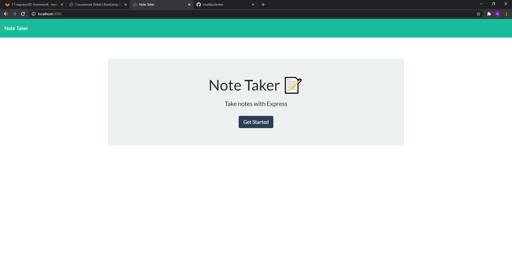
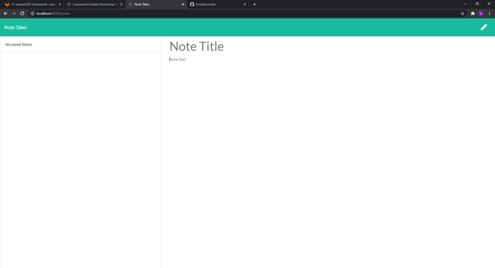

  

  # Project Title: Note Taker App

  ## Project Description:
 
  An app designed so that users can write, save and delete notes.

  ## Table of Contents
  * [Installation](#installation)
  * [Usage](#usage)
  * [License](#license)
  * [Credits](#credits)
  * [Contributors](#contributors)
  * [Test](#test)
  * [Screenshot](#screenshot)
  * [Video](#video)
  * [Questions](#questions)
  * [Badges](#badges)
  
  ## Installation:
 
  You would need to clone or fork the repo. then you woud need to run npm i, npm i express.

  ## Usage:
 
  after everything is forked and installed you would need to run nodemon server.js and that will let you know the server is working. Then in the web browser of your chioce type in localhost:8080. That should pull up the app. then write, save and delete notes to hearts desire. or you can go to the apps heroku link below.

  ## License:
  

  ## Credits:

  Kyle Rudderforth: https://github.com/kruddzz/notes
   
       Heroku Link: https://enthousiaste-chaise-00457.herokuapp.com/
  
  ## Contributors:
  
  none

  ## Test:
   
  none

  ## Screenshot:

  
  

  ## Video

  

  ## Questions:
  
  You can reach out to me useing other my email or github profile.
  
  Email: kruddzz@gmail.com
  
  Git Hub Profile: https://github.com/kruddzz

  ## Badges:
  
  
